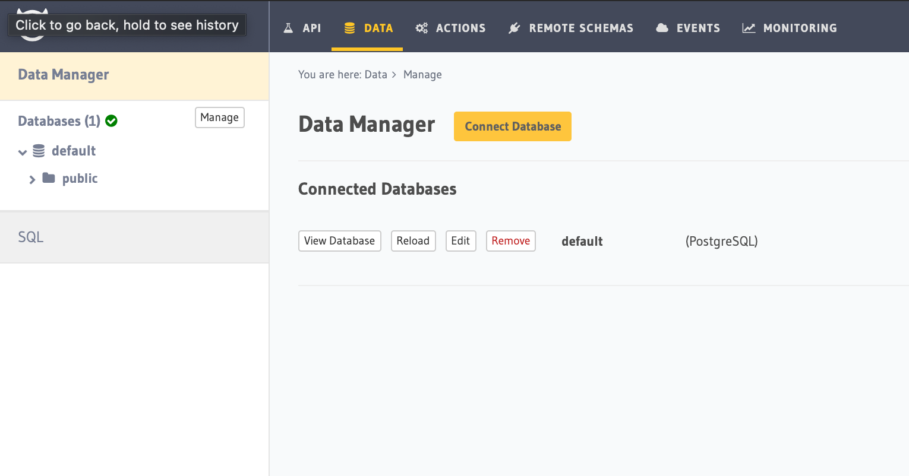

My personal website

## Install

```
npm ci
```

In case you use VS Code, install the [ESLint extension](https://marketplace.visualstudio.com/items?itemName=dbaeumer.vscode-eslint)

## Getting Started

First, run the development server:

```bash
npm run dev
```

## Stack

* Frontend: `Next.JS` and `React`
* CSS/Style: `Chakra UI`
* Backend: `Hasura`
* Auth: `Auth0`
* Deploy: `Vercel`
* Error tracking: `Sentry`
* Messenger: `Intercom`
* E2E tests: `cypress`
* Unit/Integration tests: `jest`
* Forms: `react-hook-form`
* Article formatter: `MDX`
* Data fetching: `apollo` and `SWR`
* Linter/Formatter: `Next`, `ESLint` and `Javascript Standard Style`
* Git Repo: `Github`
* CI/CD: `Github actions` and `Vercel`
* Database: `Postgres`
* Analytics: `Vercel` and `Amplitude`
* Object storage: ?
* Mailing: ?
* Metrics: ?
* Logs: ?


## Testing

### How to run unit and integration tests
```
npm test
```

### How to run E2E tests

To run the E2E tests and to save new snapshots run the following command:
```
npm run test:e2e
```


## Configuration

### Auth0
See below how to configure Auth0

#### 1. Create an application:


#### 2. Change `allowed callback URL` and `allowed logout URL`:

On your application page 
(eg: `https://manage.auth0.com/dashboard/{REGION}/{TENANT}/applications/{APPLICATION_ID}/settings`)


#### 3. Change to auth0 to new experience:


#### 4. Add following env variables to `.env.local`. Otherwise, it won't work in locally. (required for development)
```
#A long secret value used to encrypt the session cookie
AUTH0_SECRET=LONG_RANDOM_VALUE
#The base url of your application
AUTH0_BASE_URL=http://localhost:3000
#The url of your Auth0 tenant domain
AUTH0_ISSUER_BASE_URL=https://YOUR_AUTH0_DOMAIN.auth0.com
#Your Auth0 application's Client ID
AUTH0_CLIENT_ID=YOUR_AUTH0_CLIENT_ID
#Your Auth0 application's Client Secret
AUTH0_CLIENT_SECRET=YOUR_AUTH0_CLIENT_SECRET
```

Your Auth0 login and signup should be working now.

Reference: 
* https://auth0.com/blog/introducing-the-auth0-next-js-sdk/

### Hasura
See below how to configure Hasura (Also with Auth0)
#### 1. Create a project [here](https://cloud.hasura.io/projects)

#### 2. Connect to a database


#### 3. Create a users table


Table name: `users`

Fields:
* `id`: Text, PK, unique

#### 4. Create a rule on Auth0 to send more params in the payload (which will be used by Hasura)


rule code:
```
function (user, context, callback) {
  const namespace = "https://hasura.io/jwt/claims";
  context.accessToken[namespace] =
    {
      'x-hasura-default-role': 'user',
      // do some custom logic to decide allowed roles
      'x-hasura-allowed-roles': ['user'],
      'x-hasura-user-id': user.user_id
    };
  callback(null, user, context);
}
```

#### 5. Generate Auth0 config for Hasura [here](https://hasura.io/jwt-config/)


#### 6. Add the previous generated config as ENV config called `HASURA_GRAPHQL_JWT_SECRET`


#### 7. Add another rule on Auth0 to sync up users


rule code:
```
function (user, context, callback) {
  const userId = user.user_id;
  const url = "https://my-hasura-app.hasura.app/v1/graphql";
  const upsertUserQuery = `
    mutation($userId: String!){
      insert_users(objects: [{ id: $userId }], on_conflict: { constraint: users_pkey, update_columns: [] }) {
        affected_rows
      }
    }`
  const graphqlReq = { "query": upsertUserQuery, "variables": { "userId": userId } }

  request.post({
      headers: {'content-type' : 'application/json', 'x-hasura-admin-secret': configuration.HASURA_ADMIN_SECRET},
      url:   url,
      body:  JSON.stringify(graphqlReq)
  }, function(error, response, body){
       console.log(body);
       callback(null, user, context);
  });
}
```
#### 8. Add a rule variable on Auth0

The rule variable can be copied from here on Hasura:


And saved here on Auth0:


Reference:
* https://hasura.io/docs/latest/graphql/core/guides/integrations/auth0-jwt.html

### Vercel

Add following ENV vars:
